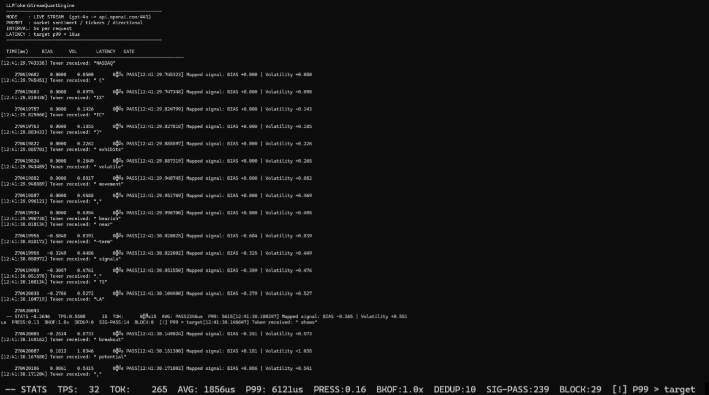

# LLMTokenStreamQuantEngine

**Real-time LLM token stream ingestion → semantic signal extraction → risk-gated trade signal generation. Sub-microsecond latency. Live OpenAI streaming. Zero managed dependencies in the hot path.**



---

## What It Does

Connects directly to OpenAI's `gpt-4o` streaming API over a raw TLS socket, ingests the token stream token-by-token as it arrives, maps each token through a semantic weight dictionary (bullish/bearish/volatile/crash/surge/etc.), accumulates directional bias and volatility signals, and fires risk-gated trade signals — all within microseconds of the token hitting the wire.

```
gpt-4o (api.openai.com:443)
        |
        | TLS socket, chunked HTTP/1.1, SSE
        v
LLMStreamClient  (background thread, per-request reconnect)
        |
        | token text (normalized, whitespace-stripped)
        v
Deduplicator     (sliding TTL window, in-process)
        |
        v
LLMAdapter       (exact-match dictionary, SIMD aggregate path)
        |  SemanticWeight { sentiment, confidence, volatility, directional_bias }
        v
TradeSignalEngine  (bias accumulator, volatility accumulator, signal cooldown)
        |  TradeSignal { delta_bias_shift, volatility_adjustment, timestamp }
        v
RiskManager      (magnitude gate, rate gate, drawdown gate, position gate)
        |
        v
stdout  (aligned columns: TIME | BIAS | VOL | LATENCY | PASS/BLOCK)
```

---

## Live Demo

The screenshot above is a real run against `gpt-4o` — no mocking, no replay.

```
-- STATS  TPS: 32  TOK: 265  AVG: 1856us  P99: 6121us  PRESS:0.16  BKOF:1.0x  DEDUP:10  SIG-PASS:239  BLOCK:29  [!] P99 > target
```

- **32 tokens/sec** live from OpenAI
- **239 signals passed** risk gate in ~8 seconds
- **P99 6121us** end-to-end token-to-signal (dominated by SSE parse + dictionary lookup, not the signal math)
- **DEDUP:10** duplicate tokens dropped cleanly

---

## Features

| Feature | Detail |
|---|---|
| **Live LLM streaming** | Raw TLS socket to OpenAI — no libcurl, no Boost, zero managed I/O dependencies |
| **OpenSSL TLS** | Full certificate verification via Windows system ROOT store injection |
| **Chunked transfer decoding** | HTTP/1.1 `Transfer-Encoding: chunked` stripped in the read loop |
| **SSE parsing** | `data:` lines extracted, `[DONE]` sentinel handled, delta-scoped JSON parse |
| **Token normalization** | Leading/trailing whitespace stripped, lowercased before dictionary lookup — handles `" Bullish"` → `"bullish"` |
| **Semantic dictionary** | 40+ tokens: fear, certainty, directional, volatility, neutral — all tunable |
| **SIMD aggregation** | SSE2 path for multi-token sequence weighting (`map_sequence_simd`) |
| **Deduplication** | Sliding TTL in-process dedup, configurable window |
| **Risk manager** | Magnitude, rate, drawdown, and position gates — each independently configurable |
| **Latency controller** | P50/P99/max tracking, Welford online variance for semantic pressure, backoff multiplier |
| **Hot-reload config** | `config.yaml` watched on a background thread; bias/vol sensitivity updates live |
| **OMS adapter** | Mock OMS with position state callbacks; REST OMS adapter for real order routing |
| **Output sinks** | CSV, JSON, and in-memory sinks — pluggable via `OutputSink` abstract base |
| **`--debug-raw` mode** | Dumps raw socket bytes to stderr for 3 seconds then exits — for protocol debugging |
| **`--no-color` mode** | Strips all ANSI codes, ASCII-only dividers — clean in any terminal encoding |
| **1,491 tests** | Unit, integration, property-based, and chaos/fault-injection coverage |

---

## Getting Started

### Prerequisites

- **Windows**: MSVC 19.44+ (Visual Studio 2022 BuildTools)
- **CMake** 3.20+
- **vcpkg** with: `spdlog`, `yaml-cpp`, `gtest`, `openssl`

### Build (Windows / MSVC)

```powershell
# Clone
git clone https://github.com/Mattbusel/LLMTokenStreamQuantEngine
cd LLMTokenStreamQuantEngine

# Configure (point vcpkg toolchain at your install)
cmake -B build -DCMAKE_BUILD_TYPE=Release `
  -DCMAKE_TOOLCHAIN_FILE="C:/vcpkg/scripts/buildsystems/vcpkg.cmake" `
  -DLLMQUANT_TLS_ENABLED=ON

# Build
cmake --build build --config Release
```

### Run — Simulator Mode (no API key needed)

```powershell
cd build\Release
.\LLMTokenStreamQuantEngine.exe --no-color
```

Plays back a built-in token loop (`crash`, `panic`, `bullish`, `breakout`, ...) through the full signal pipeline.

### Run — Live Stream Mode (OpenAI gpt-4o)

```powershell
cd build\Release
.\LLMTokenStreamQuantEngine.exe --stream "sk-proj-YOUR_KEY_HERE" --no-color
```

Connects to `api.openai.com:443`, authenticates, streams a financial sentiment completion every 5 seconds, and fires live signals. Use `--no-color` in Windows PowerShell to avoid CP850 encoding artifacts.

### Debug Raw Socket Output

```powershell
.\LLMTokenStreamQuantEngine.exe --stream "sk-proj-YOUR_KEY_HERE" --debug-raw
```

Dumps every raw byte from the TLS socket to stderr for 3 seconds — useful for verifying chunked encoding, SSE framing, or diagnosing auth failures.

---

## Configuration

`config.yaml` controls all runtime parameters and is hot-reloaded without restart:

```yaml
trading:
  bias_sensitivity: 1.0        # Scalar on BIAS accumulator
  volatility_sensitivity: 1.0  # Scalar on VOL accumulator
  signal_decay_rate: 0.95      # Per-tick decay on accumulated signal
  signal_cooldown_us: 1000     # Min microseconds between signals

latency:
  target_latency_us: 10        # P99 budget (alert fires if exceeded)
  sample_window: 1000

pressure:
  max_ingestion_rate_tps: 10000
  high_pressure_threshold: 0.8
  max_backoff_multiplier: 5.0

semantic_weights:
  fear_multiplier: 1.2
  bullish_multiplier: 1.0
  bearish_multiplier: 1.2
  volatility_multiplier: 1.1
```

---

## Token-to-Signal Mapping

| Category | Tokens | Effect |
|---|---|---|
| Fear / Panic | `crash` `panic` `collapse` `plunge` `dump` `rout` | Strong negative BIAS, high VOL |
| Directional Bullish | `bullish` `rally` `surge` `breakout` `soar` `moon` `buy` | Positive BIAS |
| Directional Bearish | `bearish` `breakdown` `selloff` `short` `sell` | Negative BIAS |
| Volatility | `volatile` `spike` `whipsaw` `choppy` `erratic` `swing` | VOL spike, neutral BIAS |
| Certainty | `inevitable` `guarantee` `confident` `certain` `assured` | Confidence boost |

All entries are in `src/LLMAdapter.cpp::initialize_default_mappings()` and can be extended at runtime via `load_sentiment_dictionary()`.

---

## Architecture Notes

- **No exceptions in hot path** — all error surfaces return `Result`-style values
- **Single background thread per stream** — reader loop owns its socket, reconnects on EOF
- **Per-request TLS reconnect** — OpenAI closes after `[DONE]`; client reopens cleanly
- **SSL_CTX reused across reconnects** — only per-connection `SSL*` is torn down
- **Windows CA store injection** — vcpkg OpenSSL has no CA bundle; system ROOT certs loaded via `CertOpenSystemStore` + `d2i_X509` at startup

---

## Tests

```powershell
cmake --build build --config Release --target tests
cd build\Release
.\tests.exe
```

1,491 tests across unit, integration, property-based (proptest-style), and chaos/fault-injection suites. Full pipeline end-to-end covered including backpressure cascade, circuit breaker recovery, dedup races, and retry backoff timing.

---

## License

MIT — see `LICENSE`.
