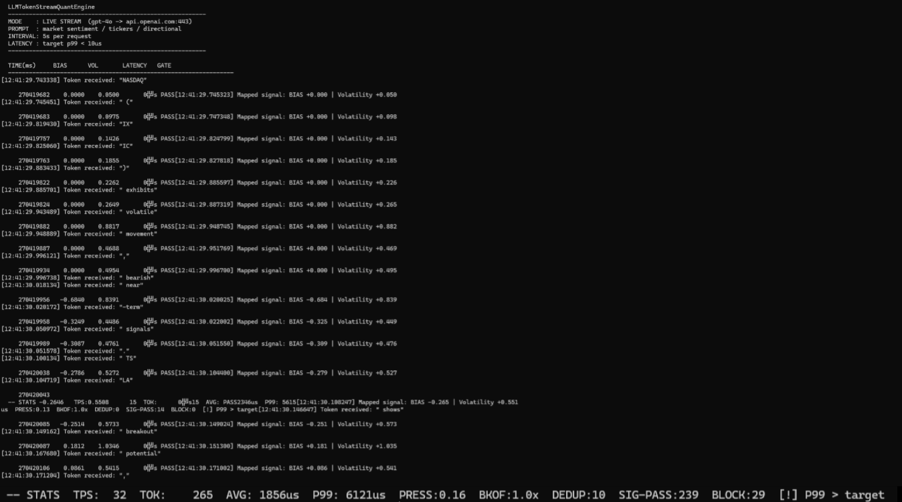

# LLMTokenStreamQuantEngine

[](https://github.com/Mattbusel/LLMTokenStreamQuantEngine/actions/workflows/ci.yml)
[](https://en.cppreference.com/w/cpp/20)
[](LICENSE)
[]()

Real-time LLM token stream ingestion, semantic signal extraction, and risk-gated trade signal generation. Sub-microsecond hot-path latency. Live OpenAI streaming. Zero managed dependencies in the signal path.



---

## Description

LLMTokenStreamQuantEngine ingests a live OpenAI `gpt-4o` token stream token-by-token as it arrives over a raw TLS socket, maps each token through a semantic weight dictionary (bullish/bearish/volatile/crash/surge and more), accumulates directional bias and volatility signals with exponential decay, and fires risk-gated trade signals. The full token-to-signal cycle completes within microseconds of the token hitting the wire.

---

## Feature Table

| Feature | Detail |
|---|---|
| Live LLM streaming | Raw TLS socket to OpenAI -- no libcurl, no Boost, zero managed I/O dependencies |
| OpenSSL TLS | Full certificate verification; Windows system ROOT store injection supported |
| Chunked transfer decoding | HTTP/1.1 Transfer-Encoding: chunked stripped in the read loop |
| SSE parsing | data: lines extracted, [DONE] sentinel handled, delta-scoped JSON parse via nlohmann/json |
| Token normalization | Leading/trailing whitespace stripped, lowercased before dictionary lookup |
| Semantic dictionary | 40+ tokens covering fear, certainty, directional, volatility, and neutral categories |
| SIMD aggregation | SSE2 path for multi-token sequence weighting (map_sequence_simd) |
| Deduplication | Sliding TTL in-process dedup; optional live Redis backend (hiredis) |
| Risk manager | Magnitude, rate, drawdown, and position gates -- each independently configurable |
| Latency controller | P50/P95/P99 tracking, Welford online variance for semantic pressure, backoff multiplier |
| Hot-reload config | config.yaml watched on a background thread; sensitivity parameters update live |
| OMS adapters | Mock, REST (HTTP polling), and FIX 4.2 session reader implementations |
| Output sinks | CSV, NDJSON, and in-memory sinks -- pluggable via OutputSink abstract base |
| Prometheus exporter | /metrics scrape endpoint on port 9100 |
| --debug-raw mode | Dumps raw socket bytes to stderr for 3 seconds then exits |
| --no-color mode | Strips all ANSI codes; ASCII-only dividers |
| Test coverage | Unit, integration, property-invariant, and chaos/fault-injection suites |

---

## Prerequisites

### Linux

| Dependency | Minimum version | Install (Ubuntu 22.04) |
|---|---|---|
| CMake | 3.20 | `apt install cmake` |
| GCC or Clang | GCC 12 / Clang 14 | `apt install build-essential clang-14` |
| spdlog | 1.9 | `apt install libspdlog-dev` |
| yaml-cpp | 0.7 | `apt install libyaml-cpp-dev` |
| nlohmann/json | 3.10 | `apt install nlohmann-json3-dev` |
| GTest | 1.11 | `apt install libgtest-dev` |
| OpenSSL (optional) | 3.0 | `apt install libssl-dev` |
| hiredis (optional) | 1.0 | `apt install libhiredis-dev` |

### Windows

| Dependency | Minimum version | Install |
|---|---|---|
| MSVC | 19.44 (Visual Studio 2022) | Visual Studio BuildTools |
| CMake | 3.20 | winget / cmake.org |
| vcpkg | current | github.com/microsoft/vcpkg |

Required vcpkg packages: `spdlog yaml-cpp gtest nlohmann-json openssl`

---

## Build Instructions

### Linux

```bash
# Clone
git clone https://github.com/Mattbusel/LLMTokenStreamQuantEngine
cd LLMTokenStreamQuantEngine

# Configure (Release)
cmake -B build -DCMAKE_BUILD_TYPE=Release

# Build
cmake --build build --parallel

# Run all tests
ctest --test-dir build --output-on-failure

# Run only unit tests
ctest --test-dir build --label-regex "unit" --output-on-failure
```

For a Debug + AddressSanitizer build:

```bash
cmake -B build-debug -DCMAKE_BUILD_TYPE=Debug
cmake --build build-debug --parallel
ctest --test-dir build-debug --output-on-failure
```

### Windows (MSVC + vcpkg)

```powershell
git clone https://github.com/Mattbusel/LLMTokenStreamQuantEngine
cd LLMTokenStreamQuantEngine

cmake -B build -DCMAKE_BUILD_TYPE=Release `
  -DCMAKE_TOOLCHAIN_FILE="C:/vcpkg/scripts/buildsystems/vcpkg.cmake"

cmake --build build --config Release

ctest --test-dir build -C Release --output-on-failure
```

---

## Quickstart

### Simulator mode (no API key required)

```bash
./build/LLMTokenStreamQuantEngine --no-color
```

Replays a built-in token loop (crash, panic, bullish, breakout, ...) through the full signal pipeline and prints a live stats bar.

### Live stream mode (OpenAI gpt-4o)

```bash
# Pass the key on the CLI
./build/LLMTokenStreamQuantEngine --stream "sk-proj-YOUR_KEY_HERE" --no-color

# Or export it as an environment variable
export LLMQUANT_API_KEY="sk-proj-YOUR_KEY_HERE"
./build/LLMTokenStreamQuantEngine --stream --no-color
```

Connects to `api.openai.com:443`, authenticates, streams a financial sentiment completion every 5 seconds, and fires live signals.

### REST OMS adapter

```bash
./build/LLMTokenStreamQuantEngine --oms 127.0.0.1:8080
```

Polls `http://127.0.0.1:8080/positions` every 500 ms and feeds position updates into the risk manager.

### Debug raw socket output

```bash
./build/LLMTokenStreamQuantEngine --stream "sk-proj-YOUR_KEY_HERE" --debug-raw
```

Dumps every raw byte from the TLS socket to stderr for 3 seconds then exits.

---

## Architecture Diagram

```
gpt-4o (api.openai.com:443)      OR     Token file / in-memory vector
        |                                         |
        | TLS socket, chunked HTTP/1.1, SSE       | disk / memory
        v                                         v
LLMStreamClient                        TokenStreamSimulator
(background thread, loop reconnect)    (SPSC ring buffer, configurable cadence)
        |                                         |
        +-------------------+---------------------+
                            |
                            | token text (string)
                            v
                      Deduplicator
                  (FNV-1a TTL window; optional Redis backend)
                            |
                            v
                       LLMAdapter
              (exact-match dictionary, SSE2 SIMD path)
                            |
                SemanticWeight { sentiment, confidence,
                                 volatility, directional_bias }
                            |
                            v
                  TradeSignalEngine
          (bias accumulator, vol accumulator, signal cooldown,
           exponential decay, OutputSink chain)
                            |
             TradeSignal { delta_bias_shift, volatility_adjustment,
                           spread_modifier, confidence, timestamp }
                            |
                            v
                       RiskManager
            (magnitude gate, rate gate, drawdown gate,
             position gate, alert/OMS callbacks)
                            |
              +-------------+---------------------+
              |                                   |
              v                                   v
       stdout (aligned columns)          OutputSink chain
       TIME | BIAS | VOL | LATENCY | GATE   (CSV / JSON / Memory)
                            |
                            v
                  PrometheusExporter
               (/metrics on port 9100)

OmsAdapter (Mock / REST / FIX 4.2) -----> RiskManager::update_position()
Config (YAML + hot-reload watcher) ------> all subsystems at startup
LatencyController ---> P99 tracking, back-pressure, backoff multiplier
MetricsLogger -------> structured CSV / NDJSON log file
```

---

## Configuration Reference

`config.yaml` is hot-reloaded without restart:

```yaml
token_stream:
  data_file_path: "tokens.txt"
  token_interval_ms: 10
  buffer_size: 1024
  use_memory_stream: false

trading:
  bias_sensitivity: 1.0
  volatility_sensitivity: 1.0
  signal_decay_rate: 0.95
  signal_cooldown_us: 1000

latency:
  target_latency_us: 10
  sample_window: 1000
  enable_profiling: true

logging:
  log_file_path: "metrics.log"
  format: "CSV"
  enable_console: true
  flush_interval_ms: 100
```

Invalid values (e.g. `signal_decay_rate: 1.5`, `buffer_size: 0`, negative sensitivities) cause the loader to return `false` and restore compiled-in defaults automatically.

---

## Token-to-Signal Mapping

| Category | Tokens | Effect |
|---|---|---|
| Fear / Panic | `crash` `panic` `collapse` `plunge` `dump` `rout` | Strong negative BIAS, high VOL |
| Directional Bullish | `bullish` `rally` `surge` `breakout` `soar` `moon` `buy` | Positive BIAS |
| Directional Bearish | `bearish` `breakdown` `selloff` `short` `sell` | Negative BIAS |
| Volatility | `volatile` `spike` `whipsaw` `choppy` `erratic` `swing` | VOL spike, neutral BIAS |
| Certainty | `inevitable` `guarantee` `confident` `certain` `assured` | Confidence boost |

All entries live in `src/LLMAdapter.cpp::initialize_default_mappings()` and can be extended at runtime via `LLMAdapter::add_token_mapping()` or `load_sentiment_dictionary()`.

---

## API Documentation

Generate HTML API docs from the Doxygen-annotated headers:

```bash
# Requires: doxygen graphviz
doxygen Doxyfile
# Output: docs/html/index.html
```

---

## Tests

```bash
# Run all tests
ctest --test-dir build --output-on-failure

# Run only unit tests
ctest --test-dir build --label-regex "unit" --output-on-failure

# Run only integration tests
ctest --test-dir build --label-regex "integration" --output-on-failure
```

The test suite covers unit, integration, property-invariant (determinism, boundary invariants, stat accounting), and chaos/fault-injection scenarios including token floods, deduplicator saturation, mid-run restarts, concurrent access, and runaway bias.

---

## Architecture Notes

- No exceptions in the hot path -- all error surfaces return Result-style values or `bool`.
- Single background thread per stream -- reader loop owns its socket, reconnects on EOF.
- Per-request TLS reconnect -- OpenAI closes after `[DONE]`; client reopens cleanly.
- `SSL_CTX` reused across reconnects -- only the per-connection `SSL*` is torn down.
- Windows CA store injection -- vcpkg OpenSSL has no CA bundle; system ROOT certs loaded via `CertOpenSystemStore` and `d2i_X509` at startup.
- `LatencyController` hot-path methods (`start_measurement` / `end_measurement` / `record_latency`) use lock-free atomics. Percentile calculation acquires a mutex on the reporting path only.
- `RiskManager::evaluate()` holds a single internal mutex for its entire execution. Alert callbacks must not call back into `RiskManager` or a deadlock will result.

---

## Contributing

1. Fork the repository and create a feature branch from `master`.
2. Write or extend tests for any changed behaviour. All new public API must include Doxygen `/** @brief */` doc-comments.
3. Run the full test suite locally: `ctest --test-dir build --output-on-failure`.
4. Run `clang-format -i` over any changed `.cpp` / `.h` files before pushing.
5. Open a pull request against `master`. The CI pipeline (build matrix + format check + Doxygen) must pass before merge.

### Code Style

- C++20; 4-space indentation, no tabs.
- `clang-format` with Google style base.
- Snake_case for identifiers; PascalCase for types.
- Prefer `std::unique_ptr` / `std::shared_ptr` over raw owning pointers.
- Prefer `std::runtime_error` / `std::invalid_argument` over `assert()` / `abort()` in library code.

---

## License

MIT. See [LICENSE](LICENSE).
