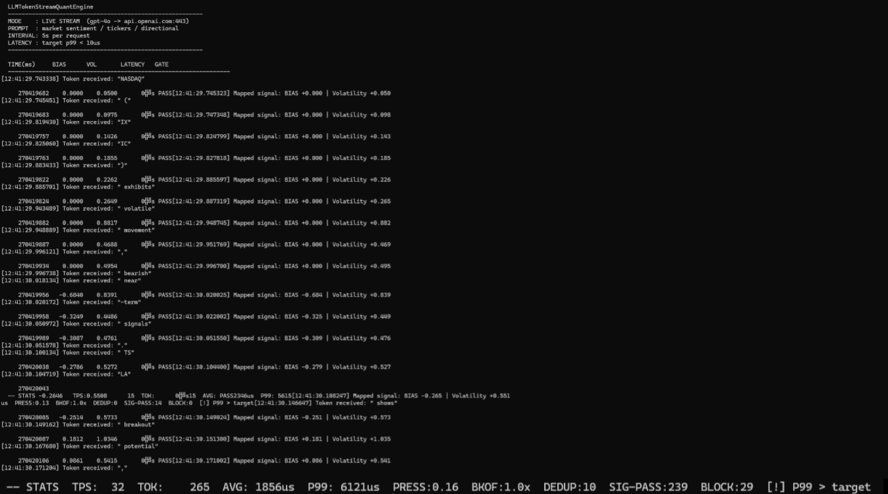

# LLMTokenStreamQuantEngine


[](https://github.com/Mattbusel/LLMTokenStreamQuantEngine/releases/tag/v1.1.0)

**A C++20 engine that reads an LLM's output token by token and turns it into trading signals in real time.**

Language models can describe market sentiment faster than a human can read it, but their output arrives as a stream of tokens, not as a number a trading system can use. This project treats the token stream itself as a market data feed: each token ("crash", "rally", "volatile", "guidance") is mapped to a directional bias, a volatility score and a confidence, those values accumulate with exponential decay, and when the accumulated bias crosses a threshold the engine emits a trade signal. Signals then pass through a stack of risk gates before reaching an order-management adapter (FIX 4.2, REST or a mock). The hot path is lock-free and allocation-free, built around a design target of under 10 microseconds from token to signal.



> **Status:** research and simulation project. It runs end to end against a built-in token simulator or a live OpenAI stream and can talk to FIX/REST order endpoints, but it is not a validated trading strategy. Use dry-run mode and paper accounts. Nothing here is financial advice.

## What it does

- **Token to weight:** `LLMAdapter` looks each token up in a built-in semantic dictionary (fear, bullish, bearish, volatility, corporate, macro, analyst, options and crypto terms) and returns a `SemanticWeight`. Multi-token sequences use an SSE2 path.
- **Signal accumulation:** `TradeSignalEngine` accumulates bias and volatility with per-token decay and optional time decay using lock-free CAS loops on `std::atomic<double>`, and emits a `TradeSignal` when the threshold is crossed.
- **Risk gates:** `RiskManager` checks bias magnitude, minimum confidence, signals per second, drawdown over a window and position limits before anything reaches an order adapter.
- **Order adapters:** FIX 4.2 (`FixOmsAdapter`, with session and sequence recovery), REST polling (`RestOmsAdapter`) and a deterministic `MockOmsAdapter`.
- **Inputs:** a token simulator (default), a live TLS stream to an OpenAI-compatible `/v1/chat/completions` endpoint (`--stream`, OpenSSL), JSONL replay (`--test-replay`) and a WebSocket feed server (`--websocket`).
- **Operations:** Prometheus `/metrics` endpoint, HTTP `/health` for Kubernetes probes, async NDJSON signal audit log, config hot reload, token de-duplication (in memory, or Redis via hiredis when available).
- **Research modules:** cross-asset correlation and hedge ratios, Naive Bayes dictionary learning from trade outcomes, HMM regime detection, alpha decay models, signal combining, execution-cost models (Almgren-Chriss impact, TWAP/VWAP), Kelly and regime-based position sizing, bootstrap confidence intervals and a backtester. Most are optional CMake targets.
- **Python bindings:** pybind11 bindings in `python/` (`bindings.cpp`, `setup.py`).

## Quick start

### Windows, no build tools

Download the pre-built executable from the [v1.1.0 release](https://github.com/Mattbusel/LLMTokenStreamQuantEngine/releases/tag/v1.1.0), extract it, edit `config.yaml` and run it. Note that the release predates many of the modules described below.

### Build from source

| Tool | Version |
|---|---|
| CMake | 3.20+ |
| Compiler | GCC 12+, Clang 15+ or MSVC 2022 (C++20) |
| Libraries | spdlog, yaml-cpp, GoogleTest, nlohmann-json; optional OpenSSL (TLS streaming) and hiredis (Redis dedup) |

Dependencies are listed in `vcpkg.json`, so the simplest route is vcpkg manifest mode:

```bash
git clone https://github.com/Mattbusel/LLMTokenStreamQuantEngine.git
cd LLMTokenStreamQuantEngine

cmake -B build -DCMAKE_BUILD_TYPE=Release \
      -DCMAKE_TOOLCHAIN_FILE=$VCPKG_ROOT/scripts/buildsystems/vcpkg.cmake
cmake --build build --parallel
```

### Run

```bash
# Simulator: replays the built-in token list through the full pipeline
./build/LLMTokenStreamQuantEngine --config config.yaml

# Evaluate signals but never call an order adapter
./build/LLMTokenStreamQuantEngine --dry-run

# Live LLM stream (TLS build); key from the argument or LLMQUANT_API_KEY
./build/LLMTokenStreamQuantEngine --stream "$OPENAI_API_KEY"

# Replay a recorded JSONL token file
./build/LLMTokenStreamQuantEngine --test-replay tokens.jsonl --output trace.jsonl

# Inspect things without running the pipeline
./build/LLMTokenStreamQuantEngine --list-tokens
./build/LLMTokenStreamQuantEngine --validate-config
./build/LLMTokenStreamQuantEngine --show-flags
```

Other useful flags: `--oms host:port` (REST adapter), `--fix host:port` (FIX 4.2 adapter), `--backtest`, `--audit-log FILE`, `--stats-port N`, `--no-prometheus`, `--quiet`. Run with `--help` for the full list and the matching `LLMQUANT_*` environment variables.

### Test

```bash
ctest --test-dir build --output-on-failure
```

The `tests/` tree holds about 3,900 GoogleTest cases across unit, integration, performance (`tests/performance/bench_hot_path.cpp`) and fuzz targets. Sanitizer builds:

```bash
cmake -B build-asan -DLLMQUANT_ENABLE_ASAN=ON -DCMAKE_BUILD_TYPE=Debug
cmake --build build-asan && ctest --test-dir build-asan
```

## Architecture

```
  Token source: TokenStreamSimulator | LLMStreamClient (TLS) | JSONL replay | WebSocket
          |
          v
   LLMAdapter              token -> SemanticWeight (static dictionary, SSE2 sequence path)
          |                  + DynamicTokenDictionary / DictionaryLearner (learned weights)
          v
  TradeSignalEngine        lock-free bias/volatility accumulation with decay, signal emission
          |
          v
  CrossAssetEngine         rolling Pearson matrix, conviction multiplier, hedge ratio
          |
          v
  RiskManager              magnitude, confidence, rate, drawdown and position gates
          |
     pass | block
          v
  OMS adapter              FIX 4.2 | REST | Mock

  Side channels: MetricsLogger, PrometheusExporter (/metrics), HealthServer (/health),
                 SignalAuditLog (NDJSON), BacktestRunner (offline replay + PnL)
```

See [docs/ARCHITECTURE.md](docs/ARCHITECTURE.md) for the latency design (no exceptions or allocation on the hot path, CAS accumulation, SSE2 aggregation, Welford variance) and [docs/TROUBLESHOOTING.md](docs/TROUBLESHOOTING.md) for common runtime problems.

| Path | Contents |
|---|---|
| `src/main.cpp` | CLI, pipeline wiring, monitoring loop |
| `src/`, `include/` | About 290 headers and 280 sources, all in `namespace llmquant`; each optional one has an `LLMQUANT_ENABLE_*` CMake option |
| `config.yaml` | Runtime configuration (hot reloadable) |
| `tests/` | GoogleTest unit, integration, performance and fuzz tests |
| `fuzz/` | libFuzzer targets (`-DLLMQUANT_ENABLE_FUZZING=ON`, clang) |
| `python/` | pybind11 bindings |
| `docs/` | Architecture notes, ADRs, troubleshooting, Doxygen config |

## Configuration

Everything lives in `config.yaml`. The main sections, with their shipped defaults:

```yaml
token_stream:
  data_file_path: "data/mock_token_streams/sample.txt"
  token_interval_ms: 10
  use_memory_stream: true      # true = use the built-in token list

trading:
  bias_sensitivity: 1.0
  volatility_sensitivity: 1.0
  signal_decay_rate: 0.95      # per-token decay of accumulated bias
  signal_cooldown_us: 1000

latency:
  target_latency_us: 10
  sample_window: 1000

metrics:
  stats_port: 9100             # Prometheus /metrics

risk_thresholds:               # hot-reloadable gate values
  max_bias_magnitude: 2.0
  min_confidence: 0.1
  max_signals_per_second: 500
  max_drawdown: 10.0
  drawdown_window_s: 60

semantic_weights:              # scale dictionary output before it reaches the engine
  sentiment_multiplier: 1.0
  confidence_multiplier: 1.0
  volatility_multiplier: 1.0
  bias_multiplier: 1.0
```

`--dump-config` prints the effective configuration and `--validate-config` checks it and exits.

## Module guide

All components live in `namespace llmquant`. A few of the larger ones:

### Cross-asset correlation (`CrossAssetEngine.h`)

Rolling Pearson correlation across symbols using Welford's online algorithm. Symbols register on first update.

```cpp
CrossAssetEngine engine(/*window_size=*/100);
engine.update_signal({"SPY", 0.72, 0.88, timestamp_ns});
engine.update_signal({"QQQ", 0.65, 0.81, timestamp_ns});

double mult = engine.compute_conviction_multiplier("SPY");   // [0.5, 2.0]
double r    = engine.get_pairwise_correlation("SPY", "QQQ");
double beta = engine.hedge_ratio("SPY", "GLD");              // minimum-variance hedge
CorrelationMatrix mat = engine.get_correlations();
```

### Dictionary learning (`DictionaryLearner.h`)

Laplace-smoothed Bernoulli Naive Bayes over labelled trade outcomes, mapped to [0, 1] token weights, with JSON import and export.

```cpp
DictionaryLearner learner("config/token_dict.json");   // "" for uniform priors
learner.record_outcome({"crash", "selloff"}, /*profitable=*/false, /*pnl=*/-342.50);
learner.record_outcome({"rally", "breakout"}, /*profitable=*/true,  /*pnl=*/820.00);

double w     = learner.get_weight("crash");
auto updated = learner.get_updated_dictionary(/*min_observations=*/10);
for (auto& lw : learner.top_weights(10)) { /* lw.token, lw.weight, lw.log_likelihood_ratio */ }
std::string snapshot = learner.export_json();
```

### Regime detection (`RegimeDetector.hpp`)

Online 3-state HMM (bearish, neutral, bullish) mapped to five `TokenRegime` labels: `BULL_TRENDING`, `BEAR_TRENDING`, `HIGH_UNCERTAINTY`, `CONSOLIDATION`, `BREAKOUT`. `RegimeFilter` only lets a signal through when the regime agrees with its direction.

```cpp
RegimeDetectorHMM detector;
detector.update(bias, timestamp_ns);
TokenRegime r = detector.current_regime();
double conf   = detector.regime_confidence();

RegimeFilter filter(detector);
filter.feed(bias, timestamp_ns);
bool should_trade = filter.evaluate(/*direction=*/+1, bias);
```

### Signal combining (`signal_combiner.hpp`)

Combine named signals with `WEIGHTED_AVERAGE`, `MAJORITY` or `ENSEMBLE` (Kalman-style) methods; `SignalHistory` keeps a ring buffer with trend and volatility.

```cpp
SignalCombiner sc;
sc.add_signal({"sentiment",   0.7, 0.85, ts_ms});
sc.add_signal({"alpha_decay", 0.4, 0.60, ts_ms});
auto result = sc.combine(CombineMethod::WEIGHTED_AVERAGE);   // action in [-1, 1], regime
```

### Alpha decay (`alpha_decay.hpp`)

Exponential, linear, power-law and step decay profiles for signal strength, plus `AlphaPortfolio` to net and prune signals per symbol.

```cpp
AlphaSignal sig{.strength = 1.0, .generated_at_ms = 1000,
                .decay_model = DecayModel{Exponential{500.0}}};
double s = AlphaDecay::current_strength(sig, 1500);   // 0.5
```

### Execution cost (`execution_timing.hpp`)

`MarketImpactModel` (Almgren-Chriss square-root and linear impact in basis points), `ExecutionScheduler` (TWAP and VWAP child orders) and `OptimalExecution` (urgency blend between the two).

```cpp
MarketImpactModel model(/*eta=*/0.1, /*alpha=*/0.5);
auto est = model.estimate(10'000.0, 1'000'000.0, 0.015);   // est->total_impact_bps

ExecutionScheduler sched(/*n_slices=*/12, /*start_ms=*/0, /*duration_ms=*/3'600'000);
auto twap = sched.twap(60'000.0, 150.0);
```

### Also included

| Header | Purpose |
|---|---|
| `regime_sizer.hpp` | Classify market regime from sentiment features and size positions per regime |
| `cross_asset_sentiment.hpp` | Sentiment correlation matrix with lead/lag detection, clustering and contagion alerts |
| `ExecutionQuality.hpp` | Lock-free ring of signal-to-fill records: slippage, p99 latency, fill rate, realised alpha |
| `TokenBacktester.hpp` | Match a signal log to OHLCV bars and report return, Sharpe, drawdown, win rate |
| `TokenWindowSummariser.hpp` | Decaying window summary of recent token weights |
| `BootstrapSignalCI.hpp` | Non-parametric bootstrap confidence interval for the signal mean |
| `KellyPositionSizer.h`, `DrawdownProtector.h` | Position sizing and loss-based risk scaling |

## Limitations

- The token dictionary is hand-built. Mapping words to bias is a heuristic, and nothing in the repo demonstrates that the resulting signals are profitable.
- The sub-10 microsecond figure is a design target for the in-process hot path. End-to-end latency in live stream mode is dominated by the network and the model (the screenshot above shows millisecond-level p99).
- `sentiment_trend`, `market_calendar` and `dynamic_dict` have sources in `src/` but are not part of the CMake build or the test suite.
- The v1.1.0 Windows binary is older than the current source.
- There is no CI workflow in the repository; build and run the tests locally.

## Contributing

Follow the existing `namespace llmquant`, `#pragma once` and Doxygen style, add GoogleTest cases under `tests/`, and run the sanitizer build before opening a pull request. See [CONTRIBUTING.md](CONTRIBUTING.md) and [CHANGELOG.md](CHANGELOG.md).

## Related

- [llm-cpp](https://github.com/Mattbusel/llm-cpp): 26 single-header C++ libraries for LLM streaming, retries, caching, RAG and more.
